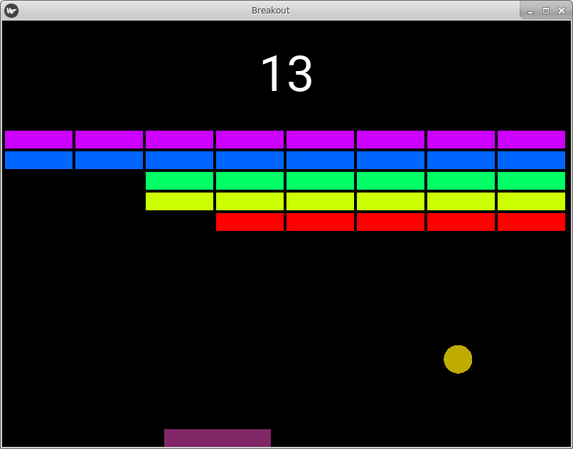

# A Basic Breakout Arcade Game

Expanding on the Kivy demo programs a bit, we are making a simple version
of the Breakout arcade game.  No power pills or anything like that (yet),
just break out the bricks for as long as you can last.



With the Kivi library installed in your Python environment, you can run the
program like this:

```
> cd <program_directory>
> python breakout.py
```
